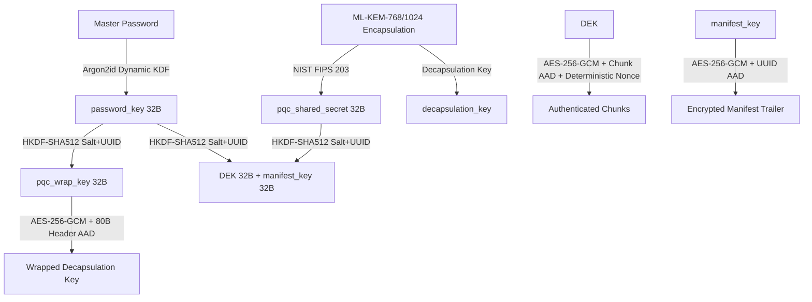

# MirageX (WRAITH v4) — Threat Model & Security Architecture Specification
### Formal Threat Analysis, Cryptographic Assumptions & Operational Boundaries

 

---

## 1. System Overview & Trust Boundaries

<strong>MirageX</strong> is a decoupled cryptographic file container engine implementing the <strong>WRAITH v4</strong> binary format. It is designed to protect static data at rest against both current classical adversaries and future quantum adversaries equipped with cryptanalytically relevant quantum computers (CRQC).

### 🛡️ Trust Assumptions
- **Trusted Endpoints:** The host operating system, local memory, and CPU executing the MirageX process are considered trusted during active execution.
- **Untrusted Storage Medium:** The physical storage medium (Local NVMe/SSD, external USB drives, NAS, Zero-Knowledge cloud providers, air-gapped backups) is completely untrusted. The adversary may read, modify, reorder, truncate, duplicate, or inject arbitrary bytes into `.wraith` containers.

---

## 2. Cryptographic Architecture & Key Schedule

### 🔬 Post-Quantum & Hybrid Security Semantics (Accurate Model)
In MirageX password-based mode:
- **Hybrid Key Combination:** The symmetric Data Encryption Key (DEK) is derived via HKDF-SHA512 combining both the classical password key (from Argon2id) and the post-quantum shared secret (from ML-KEM-768/1024).
- **Quantum Resistance:** An adversary equipped with a Cryptanalytically Relevant Quantum Computer (CRQC) attempting *Harvest Now, Decrypt Later* (HNDL) cannot use Shor's algorithm to compromise ML-KEM-768/1024 or AES-256-GCM. Grover's algorithm provides at most a quadratic speedup on symmetric key searches (reducing AES-256 from 256 to 128 effective bits of quantum security, which remains cryptographically intractable).
- **Password Dependence:** Because the decapsulation key is sealed (wrapped) using an Argon2id password-derived key, offline dictionary attacks against weak passwords remain bounded by the password's entropy and Argon2id memory/time parameters.
- **Statistical Testing Disclosure:** NIST SP 800-22 statistical test suites are utilized as an empirical verification tool for ciphertext entropy and absence of statistical bias. While essential for validating implementation correctness and PRNG behavior, empirical statistical testing does not constitute a formal mathematical security proof against cryptographic attacks.

---

## 3. Streaming Plaintext Release & Integrity Guarantees

### ⚠️ Trade-Off Analysis (Streamed AEAD vs. Monolithic Storage)
Like [`age`](https://github.com/FiloSottile/age) and [`gnupg`](https://gnupg.org/), MirageX uses an authenticated streaming cipher design:
1. **Per-Chunk Authenticity:** Every individual chunk (default 16 MiB, minimum 64 KiB, maximum 256 MiB) is authenticated using **AES-256-GCM** with associated data (`UUID || ChunkIndex || IsFinal || PayloadLen`). If an adversary modifies even a single bit within a chunk or attempts to reorder chunks, decryption of that chunk fails immediately (`ChunkTampered`).
2. **Whole-File Integrity:** The end-of-file manifest contains the overall SHA-256 digest of the entire plaintext, the exact file size, and total chunk count.
3. **Consumer Isolation via Atomic Temp Files:** To prevent partial plaintext exposure from truncated streams, all higher-level consumers (`commands::decrypt_file_cmd`, `cli::handle_decrypt`) write strictly to temporary files created with exclusive `0o600` permissions (`.miragex_dec_<rand>.tmp`). Data is flushed and synchronized to disk via `fsync` (`sync_all()`) before atomic replacement. If any chunk authentication, hash verification, or manifest decryption fails, the temporary file is **immediately wiped using multi-pass secure shredding** before returning an error to the user.

---

## 4. Mitigated Attack Vectors

| Attack Vector | Mitigation Mechanism | Implementation & Test |
| :--- | :--- | :--- |
| **Harvest Now, Decrypt Later (HNDL)** | Hybrid quantum envelope (`Argon2id + ML-KEM-768/1024`). Breaking classical discrete log/factoring does not compromise the container. | NIST FIPS 203 standard (`ml-kem` crate). |
| **Argon2 Resource Exhaustion / DoS** | Strict bounds enforced on header read (`m_cost <= 256 MiB`, `t_cost <= 10`, `p_cost <= 8`, and total `m_cost * t_cost <= 256 MiB * 10`). | `test_argon2_bounds_and_work_factor_rejected` |
| **Empty Password Acceptance** | Hard rejection of empty passwords across encrypt/decrypt engines and CLI/GUI entrypoints. | `test_empty_password_rejected` |
| **Nonce Collision / Birthday Bound** | **NIST SP 800-38D Deterministic Nonces:** `4-byte session salt || 8-byte big-endian chunk counter`. Guarantees 0% collision under the same DEK. | `generate_chunk_nonce()` in `src/crypto/aead.rs`. |
| **Header Bit-Flipping / Downgrade** | The full 80-byte header (Version, Suite, Salt, UUID, Chunk Size, Argon2 params) is sealed as AAD in the PQC envelope. | `test_header_bit_flip_tampering_fails` |
| **Symlink Following / Arbitrary File Shred** | Shredder and local storage check `symlink_metadata` and enforce `O_NOFOLLOW` (Unix) to reject symlinks and prevent TOCTOU file wiping. | `test_shred_symlink_rejected` |
| **Path Traversal & Windows Reserved Names** | Filenames are sanitized: path separators, traversal `..`, illegal characters (`:`, `*`, `?`, `"`, `<`, `>`, `|`), and Windows device names (`CON`, `PRN`, `AUX`, `NUL`, `COM1-9`, `LPT1-9`) fall back to `recovered_file.bin`. | `test_windows_device_names_and_illegal_chars_sanitization` |
| **Allocation & Length Bombs** | Parser enforces strict maximums (`suite.ciphertext_size()`, `MAX_WRAPPED_KEY_LEN = 8 KiB`, `MAX_CHUNK_SIZE = 256 MiB`, `MAX_MANIFEST_LEN = 64 KiB`). | `test_allocation_bomb_pqc_ciphertext_rejected` |
| **Trailing Garbage Injection (Smuggling)** | Strict EOF check after the authenticated manifest trailer (`WRAITHMF`). Any trailing unauthenticated byte causes rejection. | `test_trailing_garbage_after_manifest_rejected` |
| **Memory Residue / Core Dumps** | Sensitive keys, passwords, and buffers are wrapped in `zeroize::Zeroizing` and wiped on drop. | Verified across `src/crypto/`, `src/wraith/`, `src/cli.rs`. |

---

## 5. Physical Storage & Secure Wipe Limitations

<strong>Storage Physics Disclosure:</strong> 
- <strong>Magnetic Hard Drives (HDD):</strong> Multi-pass overwrite (DoD 5220.22-M with CSPRNG + 0x55 + 0xAA + 0x00) effectively destroys magnetic remnant traces. 
- <strong>Solid State Drives (SSD / NVMe / Flash):</strong> Due to the Flash Translation Layer (FTL), wear-leveling, bad-block remapping, and over-provisioning, logical software overwrites are <em>best-effort mitigations</em>. MirageX applies high-entropy random data (defeating hardware deduplication/compression), truncates to 0 bytes, and scrambles directory metadata 3 times before unlinking.

---

## 6. Supply Chain & Independent Audit Disclosure

MirageX maintains strict transparency regarding its cryptographic foundations and audit readiness:
1. **Classical Foundations:** Symmetric AEAD (`aes-gcm`), password KDF (`argon2`), key derivation (`hkdf`), and hash functions (`sha2`) use mature, battle-tested RustCrypto primitives.
2. **Post-Quantum Primitive (`ml-kem` crate):** PQC encapsulation implements NIST FIPS 203 (ML-KEM-768/1024) via the official `ml-kem = "=0.2.3"` crate (RustCrypto). In accordance with RustCrypto's official notice (*"The implementation contained in this crate has never been independently audited"*), MirageX acknowledges this experimental upstream status. No active RustSec advisories exist.
3. **Audit Status:** MirageX has completed three iterative security audit cycles (V1, V2, and V3 on September 12, 2026), remediating all 16 findings (MXA-01 to MXA-16) with 24 automated security unit and integration tests. As outlined in §15 of the original design specification, formal external third-party cryptographic certification and extended continuous fuzzing remain on the active project roadmap before production claims of third-party accreditation.

 

---

**MirageX Security Team**  
*Born in Mexico 🇲🇽 // Production-Grade Post-Quantum Cryptography*

